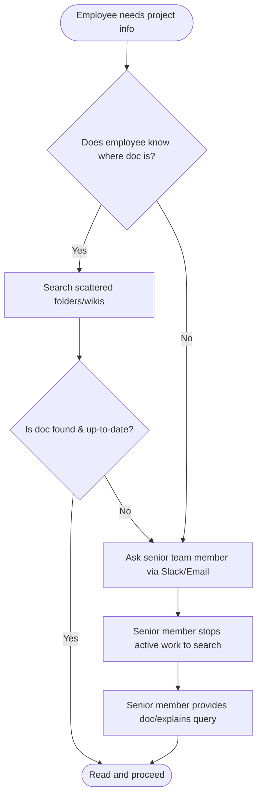
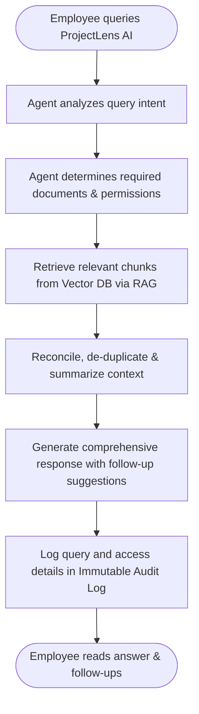
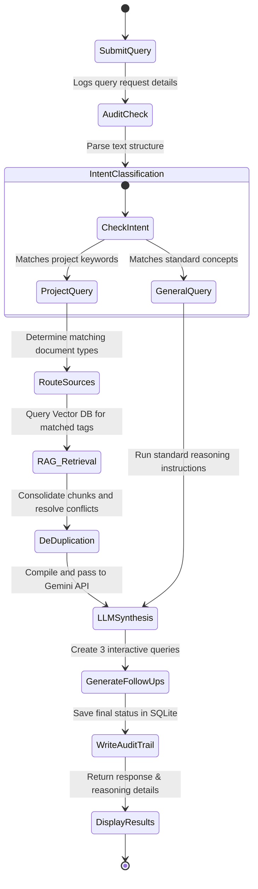
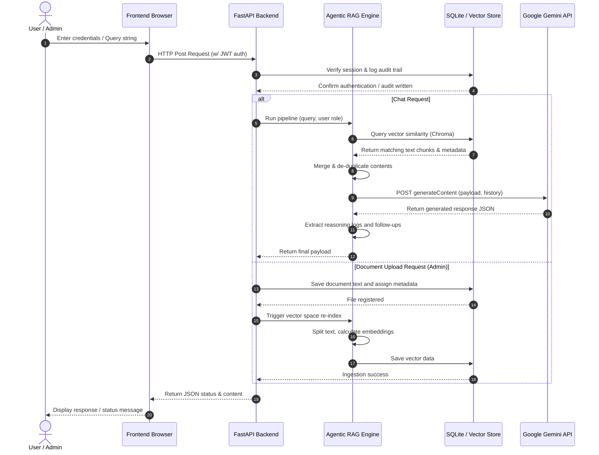

# ProjectLens AI: Business Requirements & Enterprise Architecture Specification
**Internal Enterprise Project Knowledge Discovery Platform**

---

## 1. Business Strategy & Process Design

### Business Problem
In software-driven organizations, critical project knowledge is heavily fragmented across multiple silos: Business Requirement Documents (BRDs), Functional Requirement Documents (FRDs), meeting minutes (MOMs), Confluence wikis, Jira tickets, architectural diagrams, API documentation, and internal wikis. 

When employees (Business Analysts, Developers, QA Engineers, Project Managers) join a project or transition into new teams, they face a severe information-discovery barrier. They cannot easily locate the latest specifications, understand historical architectural decisions, or identify key stakeholders. Consequently:
* **Productivity Loss**: Senior team members lose significant time answering repetitive onboarding questions.
* **Onboarding Latency**: New hires take weeks to become self-sufficient, increasing time-to-market.
* **Information Inconsistency**: Scattered documentation leads to developers writing code based on outdated files, causing bugs and rework.
* **Knowledge Silos**: Critical context remains locked in the minds of a few senior resources.

### Business Goals
* **G1**: Reduce project onboarding time for engineering and product personnel by at least 40% within the first 6 months.
* **G2**: Recover up to 20% of senior engineer and product leader capacity currently spent answering repeat questions.
* **G3**: Eliminate project misalignment bugs caused by developers working from stale or outdated requirements.
* **G4**: Maintain absolute data sovereignty by keeping all enterprise knowledge secure and within the local corporate network infrastructure.

### Business Objectives
* **O1**: Build an AI-driven, centralized semantic retrieval interface that yields high-accuracy responses within 2.5 seconds.
* **O2**: Enforce strict Role-Based Access Control (RBAC) so employees can only search documents relevant to their assigned projects.
* **O3**: Enable non-technical administrators to upload and index documents in real-time without developer intervention.
* **O4**: Create an immutable security audit trail that logs every query, system action, and user to guarantee absolute compliance.

### Stakeholder Analysis
| Stakeholder Role | Business Goal | MVP Value Proposition |
| :--- | :--- | :--- |
| **New Employee** | Fast integration into the project | Instantly answers "What is this project?", "Who is the PM?", and "Where is the API?" without scheduling meetings. |
| **Developer / QA** | Accurate implementation details | Retrieves technical rules, schemas, and requirements instantly to ensure alignment. |
| **Business Analyst (BA)** | Maintain single source of truth | Easily uploads and indexes the latest requirements, minimizing ad-hoc clarification requests. |
| **Project/Product Owner** | Accelerated delivery cycles | Ensures all team members remain aligned on project objectives, scope, and decisions. |
| **Admin / Security Officer** | Safe enterprise AI governance | Monitors system usage via audit logs, manages user credentials, and ensures strict data containment. |

---

### AS-IS Process Flow
In the current state, seeking information is unstructured, manual, and relies heavily on direct human disruption.



### TO-BE Process Flow
In the target state, the employee queries ProjectLens AI, which uses an Agentic RAG architecture to scan, retrieve, synthesize, and log the query automatically.



### Gap Analysis
| Functional Area | AS-IS Process (Current State) | TO-BE Process (ProjectLens AI) | Identified Gap | Action Plan / Feature |
| :--- | :--- | :--- | :--- | :--- |
| **Search Engine** | Keyword search across separate search bars (Jira, Confluence, Shared Drives). | Semantic search across all uploaded documents simultaneously. | Lack of cross-platform semantic understanding. | Develop Vector Database index using an embedding model. |
| **Reasoning Engine** | User must manually open multiple files, compare timelines, and resolve conflicts. | AI Agent reasons over multiple sources, merging context and resolving duplication. | Lack of an intelligent text synthesis layer. | Build an LLM Orchestration agent to filter and synthesize contexts. |
| **Security Auditing** | No unified log showing who read which internal project document. | Immutable logging of every query, matched files, and user ID. | Lack of centralized compliance tracking. | Implement an SQLite-backed Security Audit Logger. |
| **Access Control** | Fragmented access permissions per folder/wiki space. | Unified RBAC restricting search results to user role and assignments. | Lack of enterprise-grade security middleware. | Implement JWT authentication with role enforcement. |

---

## 2. Requirements & Specifications

### BRD (Business Requirements Document)
1. **System Governance**: The platform must run completely inside the enterprise environment. No external model training is permitted using corporate data.
2. **Dynamic Ingestion**: Administrators must be able to upload, index, and tag internal text documents in real-time, instantly making them searchable.
3. **Agentic Inference**: The AI system must not just search keywords; it must understand query intent (e.g., if a user asks for "onboarding overview," it should pull the Project Metadata, BRD, and Org Chart).
4. **Compliance Assurance**: An immutable database record must track every interaction to ensure compliance with enterprise data policies.

### FRD (Functional Requirements Document)

#### User Roles & Privileges
* **Employee**: Can login, view their chat history, ask questions, receive contextual answers, view dynamic follow-up questions, and review reasoning trace logs.
* **Administrator**: Has all Employee privileges plus access to the Document Management dashboard (upload files, view file registry, trigger re-indexing) and the Security Audits panel.

#### System Requirements
* **REQ-1 (Secure Authentication)**: Users must log in via credentials to generate secure JWT session tokens.
* **REQ-2 (Agent Intent Classification)**: The agent must determine if the query is general or project-specific, routing requests accordingly.
* **REQ-3 (Semantic RAG Retrieval)**: System must compute vector embeddings of queries, search the database, and fetch the top matching chunks.
* **REQ-4 (Conflict De-duplication)**: The backend must compile chunks, resolving duplicate sentences or outdated dates prior to LLM synthesis.
* **REQ-5 (Follow-up Generation)**: The agent must analyze the response context and return three highly relevant next-step questions.
* **REQ-6 (Immutable Logging)**: All queries, actions, timestamps, and roles must be written to an internal SQLite audit table.

#### Non-Functional Requirements (NFRs)
* **NFR-1 (Security)**: All sessions must expire after 2 hours. Passwords must be hashed.
* **NFR-2 (Latency)**: End-to-end response time must not exceed 3 seconds.
* **NFR-3 (Data Privacy)**: Document text is stored in a local DB and passed to Gemini API via zero-data-retention APIs (docs are never used to train the base model).
* **NFR-4 (Portability)**: The application should run locally on a single machine or VM with zero-dependency execution.

---

### User Stories & Acceptance Criteria

#### US-1: Employee Knowledge Retrieval
* **As an** Employee,  
* **I want to** type natural language queries about a project,  
* **So that** I get an consolidated, secure summary of information compiled from the BRD, FRD, and Meeting Notes.
* **Acceptance Criteria**:
  * Response must include references or citations to the source files.
  * System must suggest three follow-up questions (e.g. *Who is the Business Analyst?*).
  * System must display a "Reasoning Trace" showing which documents the Agent decided to search.

#### US-2: Admin Document Management
* **As an** Administrator,  
* **I want to** upload project text files and tag them by document type,  
* **So that** they are immediately integrated into the semantic index.
* **Acceptance Criteria**:
  * Supported formats: `.txt`, `.md`, and `.json`.
  * Upload interface must require metadata tags (e.g., project name, document type).
  * A "Re-index Knowledge Base" button must recompute embeddings.

#### US-3: Immutable Security Audit Logging
* **As a** Security Officer (Admin),  
* **I want to** inspect a tamper-proof log of all employee searches,  
* **So that** I can audit compliance and ensure no unauthorized data exploration occurred.
* **Acceptance Criteria**:
  * Logs must record: timestamp, user ID, role, exact query, sources accessed, and actions performed.
  * Audit logs must be queryable and displayed in a dashboard table.

---

## 3. Use Cases & Diagrams

### Use Case 1: Knowledge Discovery Session
* **Primary Actor**: Employee (Developer/QA/BA)
* **Preconditions**: User is authenticated and authorized.
* **Basic Flow**:
  1. Employee enters query: "What are the core specifications of Project Atlas?"
  2. System verifies active JWT token and audits the request.
  3. Agent classifies intent as a project query and identifies relevant document sources.
  4. RAG engine retrieves chunks matching "Project Atlas" specifications.
  5. LLM generates a consolidated response, lists source citations, and constructs follow-up recommendations.
  6. Response, reasoning trace, and follow-ups are returned to the user interface.

### Use Case 2: Document Indexing Session
* **Primary Actor**: Administrator
* **Preconditions**: User is logged in with `Admin` role.
* **Basic Flow**:
  1. Admin opens the Admin Panel tab.
  2. Admin selects a local `.txt` file, inputs tags (e.g., project name, document type), and clicks "Upload".
  3. System saves the file content to database and records metadata.
  4. Admin clicks "Re-index Knowledge Base".
  5. System splits documents, calculates embeddings, and populates the vector store.

---

### Activity Diagram: Query Processing
This diagram details the sequence of logic execution when a user submits a query.



### Sequence Diagram: System Interaction
This sequence diagram shows the step-by-step workflow across the client browser, API server, RAG/Agent system, and database.



---

## 4. Platform Architecture & Data Flows

### AI & Agentic RAG Architecture
ProjectLens AI implements a modular Agentic RAG topology that shifts from simple keyword retrieval to an active semantic orchestration.

```
       +-------------------------------------------------------------+
       |                     Employee Browser                        |
       +-----------------------------+-------------------------------+
                                     | (JWT Authed API Call)
                                     v
       +-----------------------------+-------------------------------+
       |                      FastAPI Router                         |
       |  - Auth & RBAC Checks                                       |
       |  - Audit Logger Middleware                                  |
       +-----------------------------+-------------------------------+
                                     |
                                     v
       +-----------------------------+-------------------------------+
       |                   Agentic Orchestrator                      |
       |  1. Intent Router (Classifies user request)                 |
       |  2. Source Selector (Map query -> BRD, FRD, Org Chart, etc) |
       |  3. Deduplicator & Context Merger                           |
       +--------------+------------------------------+---------------+
                      |                              |
                      v (Query vector)               v (Prompt payload)
       +--------------+--------------+ +-------------+---------------+
       |      Vector Storage         | |        Gemini API           |
       |  - Document Chunk Splitting | |  - Context synthesis        |
       |  - FakeEmbeddings Matcher   | |  - Question generation      |
       |  - Cosine Math Engine       | |  - No-Data-Retention Policy |
       +-----------------------------+ +-----------------------------+
```

### Data Flow Diagram (DFD) - Document Ingestion & Query
This diagram tracks how documents flow from the administrative portal into the vector store, and how queries retrieve that data.

```
[Admin Upload] ---> (File Parser) ---> [Metadata Registry (SQLite)]
                                             |
                                             v
                                     (Text Splitter)
                                             |
                                             v
                                     (Embedding Generator)
                                             |
                                             v
                                     [Vector Index DB] <-------+
                                                               | (Retriever)
[User Query] ----> (Auth & Audit) ---> (Agent Planner) --------+
                                             |
                                             v
                                      (LLM Synthesis)
                                             |
                                             v
[UI Response] <------------------------ (De-duplicator)
```

### Deployment Architecture
The platform is designed to be fully containerized or directly hosted locally on internal servers.

* **Frontend Layer**: Single Page Application (HTML/CSS/JS) served statically by the backend server.
* **Application Layer**: Python FastAPI running via Uvicorn. Completely self-contained.
* **Data Layer**:
  - **SQLite**: Local SQL database storing users, file configurations, metadata, and audit logs.
  - **In-Memory/SQLite Vector Store**: Custom pure-python vector store containing computed embedding arrays, preventing binary build compatibility issues.
* **Cognitive Inference**: Secured via internal proxy server redirecting requests to the **Google Gemini API** (using enterprise accounts that guarantee data privacy and zero-retention guidelines).

---

## 5. Enterprise Controls & Wireframes

### Risk Analysis & Mitigation
1. **Risk: LLM Data Leakage (High Impact / Low Likelihood)**
   - *Description*: Internal specifications could be indexed or used by external model vendors for public training.
   - *Mitigation*: The system communicates exclusively with enterprise Google Gemini APIs using zero-data-retention headers, meaning inputs are never stored or used to train public models.
2. **Risk: Unauthorized Access to Sensitive Documents (High Impact / Medium Likelihood)**
   - *Description*: An employee querying the platform gets access to salary information or company policies above their paygrade.
   - *Mitigation*: Strong RBAC filtering. Files tagged with high-clearance metadata are excluded from the retriever search space if the user token does not contain appropriate roles.
3. **Risk: Database Tampering (Medium Impact / Low Likelihood)**
   - *Description*: A user attempts to delete audit logs to hide unauthorized searches.
   - *Mitigation*: The audit logs DB schema is insert-only. Delete and update methods on the audit logs endpoint are omitted in the application code.

### Security Requirements
* **Data Transit**: HTTPS protocols must be enforced for all API communications.
* **Storage Encryption**: SQLite databases must be configured with volume encryption if deployed to cloud or virtualization blocks.
* **Auditability**: The Audit table logs must use auto-increment keys, making deletions or skips easily detectable by monitoring systems.

---

### Wireframe Prototype Concept

```
+------------------------------------------------------------------------------------+
|  ProjectLens AI (Enterprise Platform)                     User: admin [Admin] [Log out]
+------------------------------------------------------------------------------------+
|  [ Chat Assistant ]     [ Document Workspace ]    [ Security Audits ]
+------------------------------------------------------------------------------------+
|  CHAT ASSISTANT                                                                    |
|  +-------------------------------------------------+ +---------------------------+ |
|  | Agent Response:                                 | | Reasoning Trace:          | |
|  | Based on Project Atlas BRD and Org Chart, the   | | - User query parsed.      | |
|  | project is managed by Alice (PO) and Bob (BA).  | | - Selected sources:       | |
|  | It aims to deliver a payment gateway MVP.       | |   * Atlas_BRD.txt         | |
|  |                                                 | |   * Team_Directory.txt    | |
|  | Sources: Atlas_BRD.txt, Team_Directory.txt      | | - Retrieved 3 chunks.     | |
|  |                                                 | | - Conflicting dates       | |
|  | Follow-up Questions:                            | |   reconciled.             | |
|  | 1. Who is the Lead Developer?                   | | - Gemini API compiled.    | |
|  | 2. What is the scheduled release date?          | |                           | |
|  | 3. Where can I find the API specification?       | |                           | |
|  +-------------------------------------------------+ +---------------------------+ |
|  | Query: [ What is Project Atlas?               ] [Submit]                        | |
|  +---------------------------------------------------------------------------------+ |
|                                                                                    |
|  DOCUMENT WORKSPACE (ADMIN ONLY)                                                   |
|  +-------------------------------------------------------------------------------+ |
|  | Upload File: [Choose File]   Tag: [Project Name ] [Doc Type] [Upload]        | |
|  |                                                                               | |
|  | Registered Files:                                                             | |
|  | - Atlas_BRD.txt (Type: BRD) - Ingested 2026-07-31                             | |
|  | - Team_Directory.txt (Type: Org Chart) - Ingested 2026-07-31                  | |
|  |                                                 [Re-index Knowledge Base]     | |
|  +-------------------------------------------------------------------------------+ |
|                                                                                    |
|  SECURITY AUDITS (ADMIN ONLY)                                                      |
|  +-------------------------------------------------------------------------------+ |
|  | Time       | User    | Role  | Action | Details                               | |
|  | 17:20:10   | admin   | Admin | Query  | Query: "What is Project Atlas?"       | |
|  | 17:21:40   | admin   | Admin | Upload | Ingested: Team_Directory.txt          | |
|  +-------------------------------------------------------------------------------+ |
+------------------------------------------------------------------------------------+
```

---

## 6. Project Scope & Future Roadmap

### MVP Scope (Current Build)
* Form-based JWT authentication with fixed users (`admin` & `employee`).
* Text-based document uploading (`.txt`, `.md`, `.json`) and metadata tagging.
* Cosine-similarity retrieval on local client vector database.
* Core agent workflow: Intent analysis, cross-document consolidation, de-duplication, Gemini execution, dynamic follow-up suggestions, and reasoning telemetry details shown on the UI.
* Immutable audit logger written directly to local SQLite DB.
* High-fidelity single-page frontend.

### Future Scope (Enterprise Scale)
* **Direct Connectors**: Automatic sync with Jira APIs, Confluence spaces, and corporate Slack channels.
* **Document Parsing**: Advanced OCR ingestion pipelines to support complex PDFs, scanned meeting notes, and PowerPoint presentations.
* **Distributed Vector DB**: Migrate local vector class to production pgvector or ChromaDB cluster servers.
* **Local LLM Models**: Integration with Ollama or local Llama servers to achieve a 100% offline deployment capability.
* **Active Conflict Warnings**: Flag outdated documents to administrators automatically if new uploads contain contradictory release dates or requirements.
