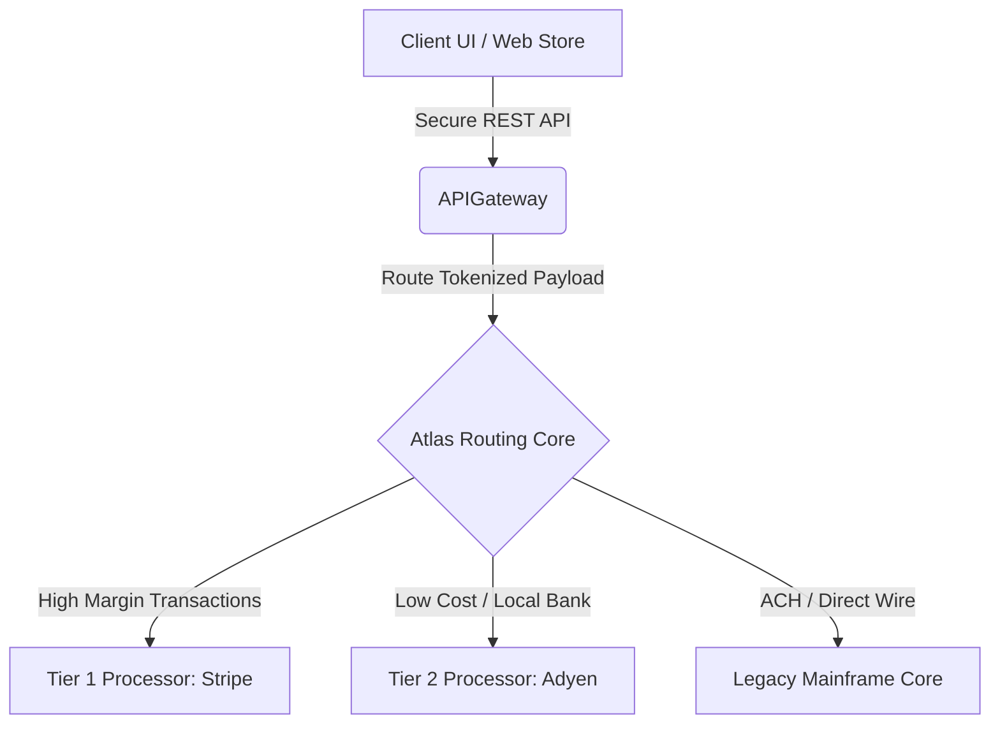

# PROJECT ATLAS - PAYMENTS & ROUTING SERVICE SPECIFICATIONS

## 1. Project Vision & Purpose
Project Atlas is the enterprise-wide unified payment gateway orchestrating transactional routing between legacy banking APIs and modern third-party credit card processing systems. It features dynamic cost-optimizing routing, real-time fraud mitigation checks, and comprehensive PCI-DSS audit trails.

---

## 2. Technical Architecture & Microservices
The backend architecture is built using a decentralized serverless microservices model running on AWS EKS and routed via APIGateway.



### Active Microservices:
1. **`atlas-tokenizer-service`**: Intercepts card inputs and issues high-entropy tokens to ensure card details never sit on internal DB databases.
2. **`atlas-routing-engine`**: Calculates processor health statistics, fees, and latency trends to dynamically choose the cheapest valid pathway.
3. **`atlas-settlement-worker`**: Cron executor running every hour at `:00` to reconcile pending batch updates and finalize ledger records.

---

## 3. API Schemas & Integration Documentation
All requests to Project Atlas require bearer authentication headers containing valid JWT tokens with `scope: payment_write`.

### Process Charge Endpoint:
* **Protocol**: HTTPS POST
* **Path**: `/api/v2/charge`
* **JSON Payload Format**:
```json
{
  "transaction_id": "tx_98124801048",
  "amount_cents": 15450,
  "currency": "USD",
  "payment_method_token": "tok_sec_893218731",
  "routing_override": "stripe",
  "billing_details": {
    "country_code": "US",
    "postal_code": "10001"
  }
}
```

* **JSON Response Format (Success HTTP 200)**:
```json
{
  "status": "APPROVED",
  "authorization_code": "auth_89124",
  "processor_utilized": "stripe",
  "settlement_time": "2026-07-31T12:00:00Z",
  "fees_incurred_cents": 45
}
```

---

## 4. Error Code & Resolution Index
When a transaction fails, Atlas returns an HTTP 400 or 422 along with standard error payloads. Use the index below to debug integration flows:

| Error Code | HTTP Status | Technical Cause | Remediation Guideline |
| :--- | :--- | :--- | :--- |
| `ERR_ATLAS_TOKEN_EXPIRED` | 400 Bad Request | The tokenized card payload expired (max lifespan 10 minutes). | Re-tokenize credit card information from UI. |
| `ERR_ATLAS_INSUFFICIENT_FUNDS` | 422 Unprocessable | The issuing bank declined the card due to credit limit bounds. | Prompt user to choose alternative checkout card. |
| `ERR_ATLAS_ROUTE_TIMEOUT` | 504 Gateway Timeout | Selected processor failed to reply within target SLA (2500ms). | Routing engine will auto-retry transaction once via fallback processor. |
| `ERR_ATLAS_PCI_VIOLATION` | 403 Forbidden | Request payload contained raw unencrypted card digits. | Instantly flag log to SecOps audit logs. Reject payload. |

---

## 5. Service Level Agreement (SLA) & Contact Directory
* **Uptime Guarantee**: 99.999% availability during peak calendar quarters.
* **Transaction Latency Target**: 95% of transactions processed within 350ms.
* **Support Contact Escalations**:
  - **Tier 1 (On-Call PM)**: Marcus Brody (`m.brody@enterprise.com` | Ext. 9912)
  - **Tier 2 (Platform Lead)**: Dr. Evelyn Pierce (`e.pierce@enterprise.com` | Ext. 9945)
  - **Escalation Group Slack**: `#atlas-ops-duty`
